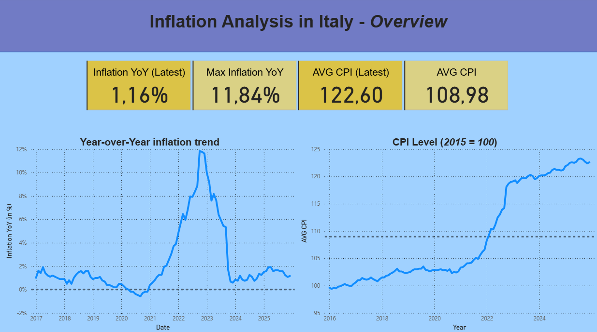
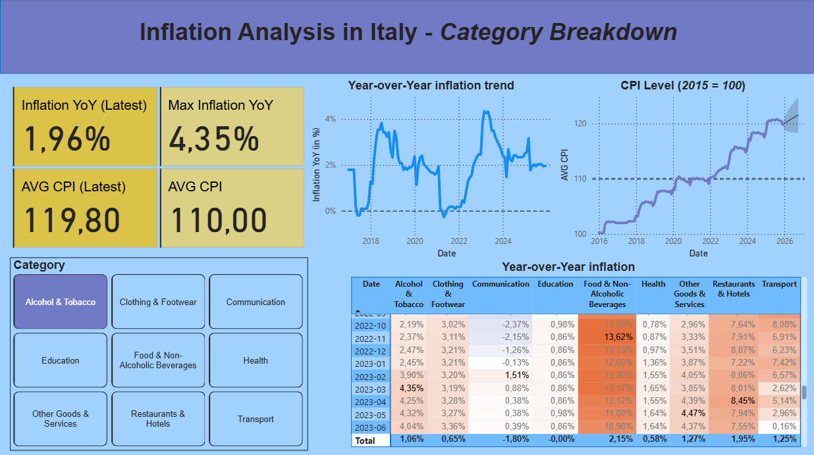
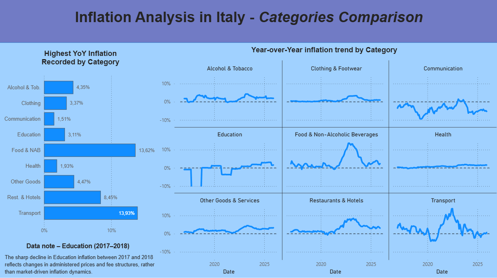

# Inflation Analysis – Italy (2016–2025)
End-to-end data analysis project using **Power BI** to analyze inflation dynamics in Italy, based on official **ISTAT** CPI and NIC data, with breakdowns by consumption categories (COICOP).

---

## Business Context

This project analyzes inflation trends in Italy between **2016 and 2025**, with a focus on both **headline inflation** and **category-level dynamics**.
The objective is to monitor how inflation has evolved over time, identify peak periods, and understand which consumption categories have contributed most to price increases.

The analysis is designed to support **macroeconomic monitoring**, **policy interpretation**, and **data-driven storytelling** using official public data.

---

## Dataset Overview

- **Time period:** January 2016 - December 2025
- **Geography:** Italy
- **Frequency:** monthly and yearly
- **Granularity:** 
    - Overall inflation (headline)
    - Inflation by consumption category (COICOP)
The dataset includes:
- **NIC (National Consumer Price Index)**
- **Year-over-Year inflation rates**
- **Price index levels** (2015 = 100)
- **COICOP categories** (e.g. Transport, Food & Beverages, Housing, Health, etc.)

---

## Data Source

The data used in this project comes from **ISTAT (Italian National Institute of Statistics)** and is publicly available as **open data**.
Monthly and annual CPI and NIC indicators
Official inflation measures used for institutional and economic analysis
The raw datasets were downloaded from the ISTAT portal and then cleaned, transformed, and reshaped for analytical purposes.

---

## Objectives & Key KPIs

The analysis focuses on the following KPIs:

- **Inflation YoY (Latest)**
- **Maximum Inflation YoY** over the period
- **Average CPI (Latest)**
- **Average CPI** over time

Additional analyses include:
- **Year-over-year inflation trends (2016–2025)**
- **CPI index level evolution** (base year 2015 = 100)
- **Category-level inflation analysis** (COICOP)
- **Comparison of inflation peaks across categories**

---

## Methodology

**Data cleaning** and preparation were performed prior to visualization to ensure:
- Consistent time indexing
- Correct category mappings
- Alignment between CPI, NIC, and YoY calculations

A **star schema** was built in Power BI, including:
- Fact table with inflation metrics
- Date dimension
- Category (COICOP) dimension

**DAX measures** were used to compute:
- Dynamic YoY inflation
- Peak and average indicators
- Category-level comparisons

All KPIs are consistently defined and reused across the dashboard pages.

---

## Project Structure
  - powerbi/    # Power BI dashboard (.pbix)
  - images/     # Dashboard screenshots
  - README.md

---

## How to Use

1. Open the Power BI file in the `powerbi/` folder.
2. Explore the Overview page for headline inflation trends and key KPIs.
3. Use the Category Breakdown page to analyze inflation by COICOP category.
4. Compare categories and inflation peaks in the Categories Comparison page.
5. Refer to the images in the `images/` folder for a static preview of the dashboard.

---

## Dashboard Preview

**Overview** – headline inflation KPIs and long-term trends
**Category Breakdown** – detailed analysis by consumption category
**Categories Comparison** – inflation dynamics across categories

---

## Key Insights

- Inflation in Italy shows a sharp acceleration starting in 2021–2022, with a clear peak during the energy crisis period.
- Headline inflation later declines, while price levels remain structurally higher.
- Inflation dynamics differ substantially across categories:
    - Transport and Energy-related categories show the highest volatility.
    - Food and non-alcoholic beverages exhibit sustained price pressure.
- Some categories display persistent inflation, even when headline inflation moderates.

---

## Tools & Skills

- **Power BI**: data modeling, DAX measures, interactive dashboards
- **Data Modeling**: star schema, fact and dimension tables
- **Data Analysis**: time series analysis, inflation metrics, category comparison
- **Data Visualization**: KPI design, trend analysis, comparative dashboards